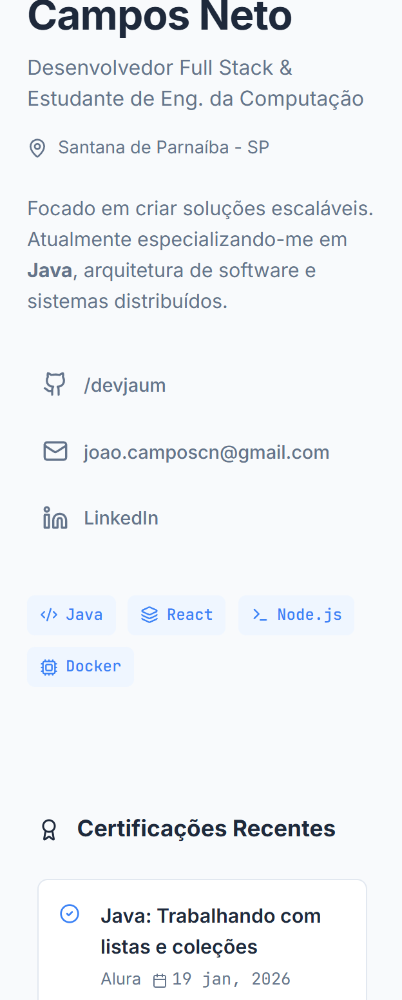

# Portfólio Pessoal | João Campos


> Um portfólio pessoal desenvolvido em React, focado em design minimalista e usabilidade.

---

## Preview

<div align="center">
  
  <br>
  <em>Captura de tela do portfólio em desktop.</em>
  <br>
  
  <br>
  <em>Captura de tela do portfólio em mobile.</em>
</div>

## Funcionalidades

- **Design Minimalista:** Interface limpa.
- **Layout Responsivo:** Sidebar fixa em desktop e layout fluido em mobile.
- **Ícones Modernos:** Utilização da biblioteca `lucide-react` para vetores nítidos e leves.
- **Seções Dinâmicas:**
  - **Bio & Tech Stack:** Apresentação rápida com badges.
  - **Certificações:** Destaque para cursos recentes (Alura/Java).
  - **Projetos:** Cards interativos com links para repositórios.
  - **Experiência:** Linha do tempo vertical.

## Tecnologias Utilizadas

Este projeto foi construído utilizando as seguintes tecnologias:

- **[React](https://reactjs.org/):** Biblioteca principal para construção da UI.
- **[Lucide React](https://lucide.dev/):** Coleção de ícones SVG open-source.
- **CSS3:** Estilização customizada com variáveis CSS (Dark/Light mode ready) e Flexbox/Grid.
- **Vite (Opcional):** Recomendado para build e desenvolvimento rápido.

## Como Rodar Localmente

Para clonar e rodar esta aplicação, você precisará do [Git](https://git-scm.com) e [Node.js](https://nodejs.org/en/download/) instalados em seu computador.

```bash
# Clone este repositório
$ git clone https://github.com/devjaum/portifolio-devjaum.git

# Acesse a pasta do projeto
$ cd portifolio-devjaum
$ cd portifolio-devjaum

# Instale as dependências
$ npm install

# Instale a biblioteca de ícones (caso não tenha instalado)
$ npm install lucide-react

# Execute a aplicação em modo de desenvolvimento
$ npm start
# OU, se estiver usando Vite:
$ npm run dev 
```
O servidor iniciará geralmente na porta `3000` ou `5173`. Acesse `http://localhost:3000` no seu navegador.

## Personalização

Para alterar os dados exibidos, edite o arquivo `src/App.jsx`. O projeto foi estruturado para que os componentes (`ProjectCard`, `CertItem`, etc.) recebam as informações via props, facilitando a manutenção.

Exemplo de como adicionar um novo projeto em `App.jsx`:

```jsx
<ProjectCard 
  title="Novo Projeto" 
  desc="Descrição do que o projeto faz." 
  link="[https://github.com/seu-usuario/projeto](https://github.com/seu-usuario/projeto)"
  tags={['Tecnologia 1', 'Tecnologia 2']}
/>
```
## Contato
João Carlos de Campos Neto
- GitHub: [devjaum](https://github.com/devjaum)
- LinkedIn: [João Campos](https://www.linkedin.com/in/devjaum/)
- E-mail: `joao.campos.cn@gmail.com`

---

## Agradecimentos

Obrigado por lerem até aqui! Sinta-se à vontade para contribuir com melhorias ou abrir issues caso encontre algum problema.
Fiquem com Deus e tenha um excelente dia!
Até uma próxima!
